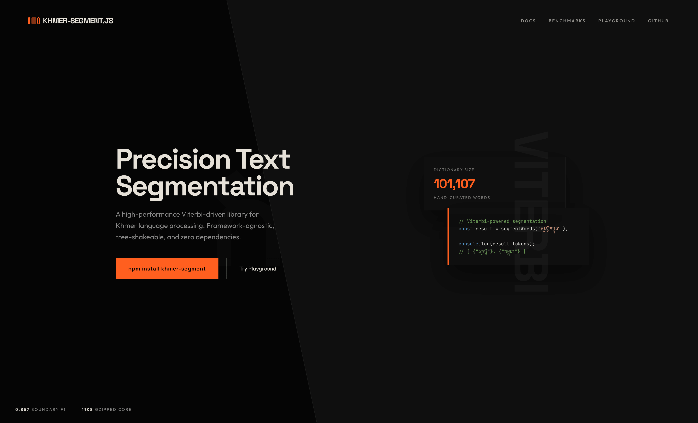

# khmer-segment

A framework-agnostic Khmer text processing library for JavaScript and TypeScript.

Works in **Next.js**, **Angular**, **React**, **Vue**, **Node.js**, and the **browser**.

Zero external dependencies. Tree-shakeable. Pure functions.



---

## Install

```bash
npm install khmer-segment
```

---

## Quick Start

```ts
import {
    containsKhmer,
    isKhmerText,
    normalizeKhmer,
    splitClusters,
    countClusters,
    createDictionary,
    segmentWords,
    getCaretBoundaries,
    deleteBackward,
} from 'khmer-segment';

// Detect Khmer text
containsKhmer('Hello សួស្តី'); // true
isKhmerText('សួស្តីអ្នក'); // true

// Normalize Unicode ordering
const text = normalizeKhmer('សួស្តីអ្នក');

// Split into grapheme clusters (not naive chars)
const clusters = splitClusters('សួស្តី'); // ["សួ", "ស្តី"]
countClusters('សួស្តី'); // 2

// Segment words with a dictionary
const dict = createDictionary(['សួស្តី', 'អ្នក', 'ទាំងអស់គ្នា']);
const result = segmentWords('សួស្តីអ្នកទាំងអស់គ្នា', { dictionary: dict });

console.log(result.tokens);
// [
//   { value: "សួស្តី", start: 0, end: 6, isKnown: true },
//   { value: "អ្នក", start: 6, end: 9, isKnown: true },
//   { value: "ទាំងអស់គ្នា", start: 9, end: 19, isKnown: true },
// ]

// Get valid caret positions
getCaretBoundaries('ក្កក'); // [0, 3, 4]

// Cluster-safe backspace
deleteBackward('ក្កក', 4); // { text: 'ក្ក', cursorIndex: 3 }
```

---

## API Reference

### Detection

| Function              | Description                                               |
| --------------------- | --------------------------------------------------------- |
| `isKhmerChar(char)`   | Returns `true` if the character is a Khmer code point     |
| `containsKhmer(text)` | Returns `true` if the text contains any Khmer characters  |
| `isKhmerText(text)`   | Returns `true` if all non-whitespace characters are Khmer |

### Normalization

| Function                         | Description                                                                                |
| -------------------------------- | ------------------------------------------------------------------------------------------ |
| `normalizeKhmer(text)`           | Reorders Khmer characters into canonical order (base → coeng → shift signs → vowel → sign) |
| `normalizeKhmerCluster(cluster)` | Normalizes a single cluster                                                                |

### Cluster Utilities

| Function                     | Description                                       |
| ---------------------------- | ------------------------------------------------- |
| `splitClusters(text)`        | Splits text into Khmer-safe grapheme clusters     |
| `countClusters(text)`        | Returns the number of clusters in the text        |
| `getClusterBoundaries(text)` | Returns `{ start, end }` offsets for each cluster |

### Text Editing

| Function                              | Description                                               |
| ------------------------------------- | --------------------------------------------------------- |
| `getCaretBoundaries(text, options?)`  | Returns valid caret positions based on cluster boundaries |
| `deleteBackward(text, cursor, opts?)` | Deletes the cluster before the cursor, returning new text |

### Segmentation

| Function                       | Description                                                    |
| ------------------------------ | -------------------------------------------------------------- |
| `segmentWords(text, options?)` | Segments text into word tokens using dictionary-based matching |

#### `SegmentOptions`

```ts
interface SegmentOptions {
    strategy?: 'fmm' | 'bmm' | 'bimm' | 'viterbi'; // default: "viterbi"
    dictionary?: KhmerDictionary;
    normalize?: boolean; // default: true
    viterbiBoundaryPenalty?: number; // default: 10.0 (Viterbi only)
}
```

**Runtime validation:** If `strategy` is provided but is not one of the four valid values, `segmentWords` throws a `TypeError` with an actionable message listing the allowed values. Non-string values (e.g., numbers, `null`) also throw `TypeError`.

#### `SegmentResult`

```ts
interface SegmentResult {
    original: string;
    normalized: string;
    tokens: SegmentToken[];
}

interface SegmentToken {
    value: string;
    start: number; // zero-based offset into result.normalized
    end: number; // exclusive offset into result.normalized
    isKnown: boolean;
}
```

When normalization is enabled, token offsets always refer to `result.normalized`. Invisible characters such as ZWS/ZWJ/BOM may be stripped during normalization, so offsets may not line up with the original input string.

### Dictionary

| Function                                | Description                                      |
| --------------------------------------- | ------------------------------------------------ |
| `createDictionary(words, frequencies?)` | Creates an in-memory dictionary from a word list |

```ts
const dict = createDictionary(['សួស្តី', 'អ្នក', 'ខ្មែរ']);

dict.has('សួស្តី'); // true
dict.hasPrefix?.('សួ'); // true (trie-based O(k) lookup)
dict.hasSuffix?.('ី'); // true
dict.size; // 3 unique words
```

#### `KhmerDictionary` interface

```ts
interface KhmerDictionary {
    has(word: string): boolean;
    hasPrefix?(value: string): boolean;
    hasSuffix?(value: string): boolean;
    getFrequency?(word: string): number | undefined;
    size: number;
}
```

You can implement this interface for custom dictionary backends (remote, compressed, etc.).

### Default Dictionary (`khmer-segment/dictionary`)

A pre-built Khmer dictionary with **101,107 words** sourced from [khmerlbdict](https://github.com/silnrsi/khmerlbdict) (MIT), the Royal Academy of Cambodia's Khmer Dictionary, and [Sovichea's Khmer Segmenter dictionary](https://github.com/Sovichea/khmer_segmenter). Includes frequency data for frequency-aware segmentation.

```ts
import {
    getDefaultDictionary,
    getFrequencyDictionaryView,
    loadFrequencyDictionary,
} from 'khmer-segment/dictionary';
import { segmentWords } from 'khmer-segment';

const dict = getDefaultDictionary();

console.log(dict.size); // 101107
console.log(dict.has('កម្ពុជា')); // true

const result = segmentWords('សួស្តីអ្នកទាំងអស់គ្នា', { dictionary: dict });

const freqData = loadFrequencyDictionary();
console.log(freqData.words.length); // 101107
console.log(freqData.frequencies.get('ជា')); // 701541

const freqView = getFrequencyDictionaryView();
console.log(freqView.words.length); // 101107 (cached readonly view)
```

This is a **separate import** — the core `khmer-segment` package stays small (~11KB). The dictionary build artifact is large (roughly ~8MB per JS format), so only import the dictionary module when you need it.

`loadFrequencyDictionary()` builds its return value from cached dictionary data, but each call returns fresh arrays and a fresh `Map`. You can safely extend or mutate the returned data without affecting later calls.

`getFrequencyDictionaryView()` returns a stable readonly view over the cached dictionary data. Prefer this in hot paths where you want to avoid per-call cloning.

---

## How It Works

### Segmentation Pipeline

```
input text
  → normalize (reorder Unicode marks into canonical order)
  → split into clusters (not naive chars)
  → run segmentation algorithm (FMM, BMM, BiMM, or Viterbi)
  → group consecutive digits into single tokens
  → return structured tokens
```

### Cluster Splitting

Khmer characters combine into grapheme clusters. A naive `text.split("")` breaks them incorrectly.

```
"ស្តី" → naive split: ["ស", "្", "ត", "ី"] (4 pieces, broken)
"ស្តី" → splitClusters: ["ស្តី"] (1 cluster, correct)
```

A cluster starts with a **base** (consonant or independent vowel) and accumulates:

- `្` (coeng) + consonant → subscript pair
- dependent vowels
- diacritic signs

### FMM (Forward Maximum Matching)

Scans left-to-right, greedily matching the **longest** word at each position using trie-based prefix lookup. Falls back to single unknown tokens when no match is found.

### BMM (Backward Maximum Matching)

Same idea as FMM, but scans right-to-left. Can produce different segmentation on ambiguous input where FMM greedily matches from the left.

### BiMM (Bidirectional Maximum Matching)

Runs both FMM and BMM, then picks the better result using heuristics: fewer unknown tokens wins; if tied, fewer total tokens (longer matches) wins; if still tied, FMM is preferred. This generally produces better results than either FMM or BMM alone.

### Viterbi

Frequency-weighted dynamic programming segmentation. Finds the globally lowest-cost path through all possible word boundaries using `-log(frequency)` as word cost. Requires a dictionary with frequency data.

**Default strategy** as of v0.4.0. With a boundary penalty of 10.0, Viterbi achieves Boundary F1 = 0.8572 (+5.3% over BiMM) and Token F1 = 0.6744 (+4.2% over BiMM) while maintaining superior OOV handling (OOV Boundary F1 = 0.8875 vs BiMM's 0.4186).

### Text Editing

#### `getCaretBoundaries(text, options?)`

Returns an array of valid caret positions (indices where the cursor can rest) based on Khmer cluster boundaries.

```ts
import { getCaretBoundaries } from 'khmer-segment';

getCaretBoundaries(''); // [0]
getCaretBoundaries('ក'); // [0, 1]
getCaretBoundaries('ក្ក'); // [0, 3] — coeng+subscript is one cluster
getCaretBoundaries('កក'); // [0, 1, 2] — two clusters
```

#### `deleteBackward(text, cursorIndex, options?)`

Deletes the cluster (or character) before the cursor, respecting cluster boundaries.

```ts
import { deleteBackward } from 'khmer-segment';

deleteBackward('កក', 2); // { text: 'ក', cursorIndex: 1 }
deleteBackward('ក្កក', 4); // { text: 'ក្ក', cursorIndex: 3 } — deletes last cluster
deleteBackward('ក', 0); // { text: 'ក', cursorIndex: 0 } — no-op at start
```

#### `CaretOptions`

```ts
interface CaretOptions {
    normalize?: boolean; // default: false — operate on raw text
}

interface DeleteResult {
    text: string;
    cursorIndex: number;
}
```

### Typing game support

Compare a prompt to user input with **grapheme-cluster-aware** progress (default), or whitespace-delimited words. Use `computeTypingMetrics` for WPM (5 characters = 1 word), CPM, and accuracy.

```ts
import { compareTyping, computeTypingMetrics } from 'khmer-segment';

const prompt = 'សួស្តីអ្នក';
const typed = 'សួស្តី';
const cmp = compareTyping(prompt, typed);
// cmp.correctUnits, cmp.unitStates, cmp.mismatchOffset, cmp.isComplete

const elapsedMs = 30_000;
const metrics = computeTypingMetrics({
    correctCharCount: cmp.correctPrefixLength,
    totalTypedCharCount: cmp.normalizedTyped.length,
    elapsedMs,
});
// metrics.wpm, metrics.cpm, metrics.accuracy
```

Subpath (same API): `import { compareTyping } from 'khmer-segment/typing'`.

See [`docs/typing-game.md`](docs/typing-game.md) for IME/composition notes and integration patterns.

### React Hooks (`khmer-segment/react`)

`khmer-segment/react` provides controlled-input hooks for React:

- `useKhmerSegments` for memoized segmentation output
- `useKhmerTyping` for caret-safe typing helpers
- React peer requirement: `react >= 18`

```ts
import { useKhmerSegments, useKhmerTyping } from 'khmer-segment/react';
import { getDefaultDictionary } from 'khmer-segment/dictionary';

const dict = getDefaultDictionary();

const { segment } = useKhmerSegments({
    value,
    dictionary: dict,
    segmentOptions: { strategy: 'viterbi' },
});

const { caretBoundaries, snapCaret, deleteBackwardAtCaret } = useKhmerTyping({
    value,
    selectionStart,
    caretOptions: { normalize: true },
});
```

`useKhmerTyping` works in the same text space as `deleteBackward` and `getCaretBoundaries`. If `caretOptions.normalize` is enabled, caret positions and deletion are computed on normalized text.

For best hook performance, keep `dictionary`, `segmentOptions`, and `caretOptions` references stable (for example with `useMemo`) when values are unchanged.

Example controlled input wiring:

```tsx
import { useState } from 'react';
import { useKhmerTyping } from 'khmer-segment/react';

export function KhmerInput(): JSX.Element {
    const [value, setValue] = useState('សួស្តីអ្នក');
    const [selectionStart, setSelectionStart] = useState(value.length);
    const { deleteBackwardAtCaret } = useKhmerTyping({
        value,
        selectionStart,
    });

    return (
        <input
            value={value}
            onChange={event => {
                setValue(event.target.value);
                setSelectionStart(event.target.selectionStart ?? 0);
            }}
            onKeyDown={event => {
                if (event.key !== 'Backspace') return;
                event.preventDefault();
                const { nextValue, nextCaret } = deleteBackwardAtCaret();
                setValue(nextValue);
                setSelectionStart(nextCaret);
            }}
        />
    );
}
```

### Angular (`khmer-segment/angular`)

`khmer-segment/angular` provides Angular adapters for DI and templates:

- `KhmerSegmentService` (injectable full-core facade)
- `KhmerNormalizePipe` (standalone `khmerNormalize` pipe)
- Angular peer requirement: `@angular/core >= 17`

```ts
import { KhmerNormalizePipe, KhmerSegmentService } from 'khmer-segment/angular';

const service = new KhmerSegmentService();
const dict = service.createDictionary(['សួស្តី', 'អ្នក']);
const segment = service.segmentWords('សួស្តីអ្នក', { dictionary: dict });

const pipe = new KhmerNormalizePipe();
const normalized = pipe.transform('\u200Bក\u200Bក\u200B');
```

```ts
import { Component, inject } from '@angular/core';
import { KhmerNormalizePipe, KhmerSegmentService } from 'khmer-segment/angular';

@Component({
    selector: 'app-khmer-demo',
    standalone: true,
    imports: [KhmerNormalizePipe],
    template: `
        <p>{{ value | khmerNormalize }}</p>
        <button type="button" (click)="segment()">Segment</button>
    `,
})
export class KhmerDemoComponent {
    value = 'សួស្តីអ្នក';
    private readonly khmer = inject(KhmerSegmentService);

    segment(): void {
        console.log(this.khmer.segmentWords(this.value).tokens);
    }
}
```

### Digit Grouping

Consecutive Khmer digit clusters (and ASCII digits) are automatically merged into a single token after segmentation, so `១៨៤` or `184` becomes one token instead of three separate tokens.

---

## No Dictionary Provided

When no dictionary is passed to `segmentWords()`, it returns each cluster as an unknown token:

```ts
const result = segmentWords('កខគ');
// tokens: [
//   { value: "ក", isKnown: false },
//   { value: "ខ", isKnown: false },
//   { value: "គ", isKnown: false },
// ]
```

---

## Dictionary Strategy

The library ships a **separate optional dictionary** via `khmer-segment/dictionary` with 101,107 Khmer words. This keeps the core package small (~11KB).

Options:

- Use the pre-built default: `getDefaultDictionary()` from `khmer-segment/dictionary`
- Provide your own word list via `createDictionary(words)`
- Load a JSON file at runtime
- Combine both: spread default words + your custom words
- Implement the `KhmerDictionary` interface for custom backends

```ts
// Option 1: Use the built-in dictionary
import { getDefaultDictionary } from 'khmer-segment/dictionary';
const dict = getDefaultDictionary();

// Option 2: Custom word list only
import { createDictionary } from 'khmer-segment';
const dict = createDictionary(['សួស្តី', 'អ្នក']);

// Option 3: Combine default + custom words
import { loadFrequencyDictionary } from 'khmer-segment/dictionary';
import { createDictionary } from 'khmer-segment';
const { words, frequencies } = loadFrequencyDictionary();
const dict = createDictionary([...words, 'custom_word'], frequencies);
```

---

## Framework Compatibility

| Environment         | Support |
| ------------------- | ------- |
| Node.js (ESM + CJS) | Yes     |
| Browser (ESM)       | Yes     |
| Next.js             | Yes     |
| React               | Yes     |
| Angular             | Yes     |
| Vue                 | Yes     |

No framework-specific code in the core. Tree-shakeable with `sideEffects: false`.

---

## Limitations

- Dictionary-based approaches have an inherent accuracy ceiling compared to statistical/ML methods (e.g. CRF achieves ~99.7% accuracy vs ~86% boundary F1 for dictionary-based matching)

---

## Benchmark

Measured on the `kh_data_10000b` dataset (87,875 sentences from [phylypo/segmentation-crf-khmer](https://github.com/phylypo/segmentation-crf-khmer)) with the default 101,107-word dictionary.

| Strategy    | Boundary F1 | Token F1   | Exact Match | OOV Rate | OOV Boundary F1 | Relative Speed  |
| ----------- | ----------- | ---------- | ----------- | -------- | --------------- | --------------- |
| **Viterbi** | **0.8572**  | **0.6744** | **1.4%**    | 5.4%     | **0.8875**      | 1.4x            |
| BiMM        | 0.8041      | 0.6327     | 2.0%        | 32.6%    | 0.4186          | 1.0x (baseline) |
| FMM         | 0.8024      | 0.6304     | 2.0%        | 32.8%    | —               | 0.5x            |
| BMM         | 0.7981      | 0.6239     | 1.8%        | 32.6%    | —               | 0.7x            |

**Recommended:** `strategy: 'viterbi'` (default) for best accuracy. See `[docs/benchmark-results.md](docs/benchmark-results.md)` for full details and `[docs/benchmark-methodology.md](docs/benchmark-methodology.md)` for methodology.

---

## Roadmap

### v0.1.0

- `isKhmerChar`, `containsKhmer`, `isKhmerText`
- `normalizeKhmer`, `normalizeKhmerCluster`
- `splitClusters`, `countClusters`, `getClusterBoundaries`
- `createDictionary` (trie-based in-memory)
- `segmentWords` with FMM
- Default dictionary (34K+ words, separate import)

### v0.2.1

- BMM (Backward Maximum Matching) algorithm
- BiMM (Bidirectional Maximum Matching) algorithm
- Digit grouping (consecutive Khmer digits merged into single tokens)
- Fixed normalization for MUUSIKATOAN (៉) and TRIISAP (៊) — shift signs now placed before vowels
- Fixed Unicode range constants (NIKAHIT, REAHMUK, YUUKEALAKHMOU are signs, not vowels)
- Rebuilt dictionary with 49,113 words (merged from 10 sources)

### v0.2.2

- Clarified that token offsets are measured against `result.normalized`
- Expanded Vitest coverage across normalization, dictionary, and segmentation behavior
- Made `loadFrequencyDictionary()` safe to reuse across calls without shared-state pollution
- Corrected custom dictionary `size` to report unique non-empty words
- Added changelog, CI checks, and stricter prepublish formatting verification

### v0.3.0

- **Viterbi algorithm** — frequency-weighted DP segmentation
- **Dictionary expansion** — 49,113 → 101,107 words (merged from Sovichea/khmer_segmenter + SIL + Royal Academy)
- **Full Unicode normalization** — composite vowel fixing, ROBAT ordering, stacked coeng support
- **Full KCC cluster model** — ROBAT continuation, independent vowel bases
- **Accuracy benchmarking** — 87,875-sentence gold standard, per-strategy metrics

### v0.4.0

- **Default strategy switched to Viterbi** (penalty=10.0): Boundary F1 = 0.8572, Token F1 = 0.6744
- `**getCaretBoundaries(text)` — returns valid caret positions based on Khmer cluster boundaries
- `**deleteBackward(text, cursorIndex)`\*\* — cluster-safe backspace for text editors
- **Extended Viterbi penalty sweep** — range [0.25–10.0], documented in `docs/viterbi-penalty-sweep.md`

### v0.5.1

- **Audit hardening pass** — aligned code/docs/tests with v0.5.0 audit findings
- **Type cleanup** — digit grouping now uses `SegmentToken` end-to-end (removed fragile cross-algorithm coupling)
- **Shared Khmer char helpers** — centralized `isRobat` and `cpAt` usage across core and Viterbi paths
- **Caret normalization coverage** — added tests for `deleteBackward(..., { normalize: true })` when normalization changes text length
- **CI compatibility matrix** — validates Node 18 and Node 20
- **Trie cleanup** — removed internal expensive `Trie.hasSuffix()` path and simplified node traversal logic
- **Lint/test quality improvements** — removed lingering warnings and kept full suite green

### v0.6.0

- **React hooks release** — `khmer-segment/react` now ships `useKhmerSegments` and `useKhmerTyping` for controlled inputs
- **React packaging** — added `./react` subpath build and exports with optional `react >= 18` peer metadata
- **Hook test coverage** — added React-focused tests for segmentation updates, caret snapping/deletion, normalization mode, and mixed-script inputs
- **Security hygiene** — dev dependency audit issue resolved (Vite advisory chain cleared via lockfile update)

### v0.6.1

- Reordered roadmap entries into ascending version order for easier historical scanning

### v0.8.0 (current)

- **Typing game support** — `compareTyping`, `computeTypingMetrics`, `getCorrectPrefixLength`, `getFirstMismatchIndex` for cluster/word-aware progress and WPM-style metrics
- **`khmer-segment/typing` subpath** — optional dedicated export matching root typing APIs
- **Documentation** — [`docs/typing-game.md`](docs/typing-game.md) guide; design doc updated for typing scope
- **Playground** — live typing demo with `compareTyping` + `computeTypingMetrics`
- **Tests** — `src/__tests__/typing/` coverage for comparison and metrics

### v0.7.0

- **Angular release** — `khmer-segment/angular` now ships `KhmerSegmentService` and standalone `KhmerNormalizePipe`
- **Angular packaging** — added `./angular` subpath build and exports with optional `@angular/core >= 17` peer metadata
- **Angular test coverage** — added adapter tests to ensure parity with core normalization/caret/segmentation behavior

### v0.6.2

- Reliability release with CI benchmark hardening and pinned local tooling
- Runtime guards for public APIs and safer React hook dependency handling
- Segmentation performance improvements in Viterbi/BMM hot paths and cluster counting
- Documentation refresh with canonical docs index and updated release notes

### Future

- ICU-style line-breaking helpers

---

## Development

```bash
npm install       # install dependencies
npm run build     # build with tsup (ESM + CJS + types)
npm test          # run vitest
npm run test:perf # optional performance-focused checks
npm run test:watch  # watch mode
npm run lint      # TypeScript type check + ESLint
```

---

## Testing

### Automated Tests

```bash
npm test              # run the main Vitest correctness suite
npm run test:perf     # non-blocking CI perf checks (relative thresholds)
npm run test:accuracy # run full accuracy benchmark and write docs/benchmark-results.*
npm run test:accuracy:check # accuracy benchmark + baseline regression gate (manual/scheduled CI)
npm run test:watch    # watch mode — re-runs on changes
npm run lint          # TypeScript type check + ESLint
```

CI behavior:

- Blocking checks on push/PR: build, test, lint, format.
- `test:perf` runs as a separate non-blocking CI job.
- Accuracy benchmark download/regression runs on manual dispatch or schedule.

## Project Docs

- Canonical docs index: [`docs/README.md`](docs/README.md)
- Release history and migration notes: [`CHANGELOG.md`](CHANGELOG.md)

### Manual Testing (Playground)

An interactive playground is available for live manual testing of all library functions.

```bash
cd playground
npm install
npm run dev
```

Open the URL shown (typically **[http://localhost:5173](http://localhost:5173)**) in your browser.

Features:

- Live Khmer text input with instant results
- Editable dictionary (add/remove words on the fly)
- Strategy selector (FMM / BMM / BiMM / Viterbi)
- Normalize toggle (On/Off)
- Caret boundary visualization
- Typing game demo (`compareTyping` + `computeTypingMetrics` with live prompt highlighting)
- Detection, normalization, cluster splitting, and segmentation panels
- JSON output with copy button

---

## References & Further Reading

- **[Word Segmentation of Khmer Text Using Conditional Random Fields](https://medium.com/@phylypo/segmentation-of-khmer-text-using-conditional-random-fields-3a2d4d73956a)** — Phylypo Tum (2019). Comprehensive overview of Khmer segmentation approaches from dictionary-based to CRF, achieving 99.7% accuracy with Linear Chain CRF.
- **[Khmer Word Segmentation Using Conditional Random Fields](https://www.niptict.edu.kh/khmer-word-segmentation-tool/)** — Vichea Chea, Ye Kyaw Thu, et al. (2015). The prior state-of-the-art CRF model for Khmer segmentation (98.5% accuracy, 5-tag system).
- **[Benchmark dataset and Python notebooks](https://github.com/phylypo/segmentation-crf-khmer)** — 10K+ segmented Khmer news articles useful for evaluating segmentation quality.
- **[khmerlbdict](https://github.com/silnrsi/khmerlbdict)** — Source of the default dictionary used by this library (MIT license). Merged with Royal Academy of Cambodia's Khmer Dictionary and Sovichea's Khmer Segmenter dictionary for a total of 101,107 words.

---

## License

MIT
